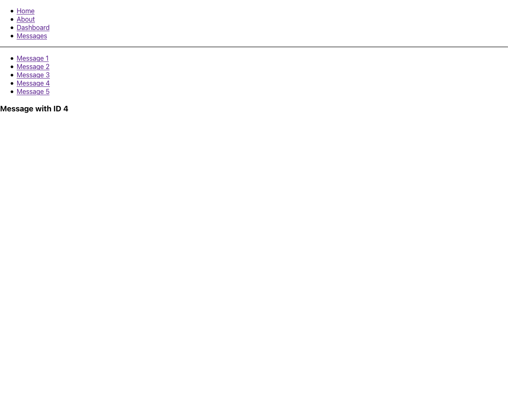

# React Router



## History

- length: is the number of entries in the history stack
- action: The current action performing. it says how you got to the component. (push, replace or pop)
- location: The current location, it can have the properties: pathname, search, hash, and state. Remember it is mutable
- push(path, [state]): (function), pushes a new entry onto the history stack
- replace(path, [state]): (function), replaces the current entry on the history stack
- o(n): (function), moves the pointer in the history stack by n entries
- goBack(): (function), equivalent to go(-1). It lets us go back to the previous screen in the navigator.
- goForward(): (function,) equivalent to go(1)
- block(prompt): (function), prevents navigation

### create redirect

```jsx
const handleLogout = history => () => {
  //perform action for logging out and aftewards we use:
  history.push('/main');
};
```

### Also

```js
    history.replace("/my-path")
```

is equivalent to

```jsx
<Redirect to="/my-path"/>
```

source: https://medium.com/@mcastorena0316/react-routes-the-wonders-of-match-history-and-location-3c525ba7d48b
